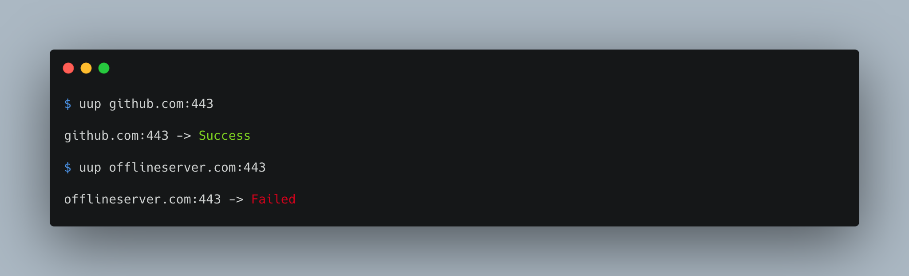

# uup (You Up?)

A fast and lightweight ping alternative / TCP tester for macOS



uup connects using TCP instead of ICMP, allowing for greater compatibility

### Example:
In this example, we reboot a server while using uup to monitor it coming back online


### Installation:

#### Homebrew (recommended):
```
brew install jackdcasey/tap/uup
```
#### From source:
```
git clone https://github.com/jackdcasey/uup && cd uup
make install
```

### Usage:
```
USAGE: test-options <address> [--port <port>] [--count <count>] [--delay <delay>] [--recurrent] [--time]

ARGUMENTS:
  <address>               The address used to connect to

OPTIONS:
  -p, --port <port>       The TCP port used to connect with (default: 443)
                          Can also be specified in address:port format
  -c, --count <count>     How may times to run the test (default: 1)
  -d, --delay <delay>     How many seconds to wait betwen tests (default: 2)
  -r, --recurrent         Run test indefinitely
  -t, --time              Display the time when testing
  -h, --help              Show help information
```
### Uninstallation:

#### Homebrew:
```
brew uninstall uup
```
#### From source:

```
cd <path to uup repo>
make uninstall
```


