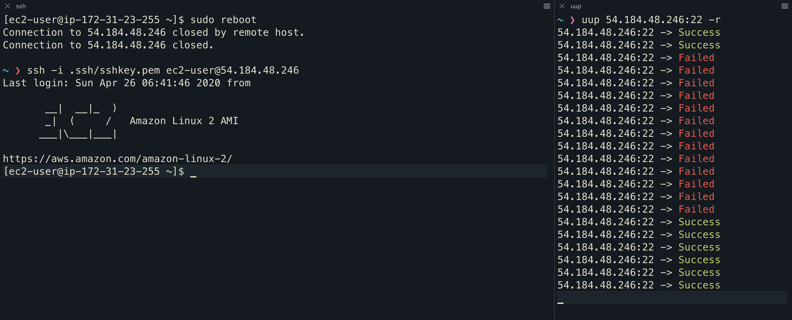

# uup (You Up?)

A fast and lightweight ping alternative for macOS 🏎

```
~ ❯ uup github.com:443                                                                                                       
github.com:443 -> Success

~ ❯ uup someofflineserver.com:443                                                                                           
someofflineserver.com:443 -> Failed
```
uup connects using TCP instead of ICMP, allowing for greater compatibility ⚡️

### Example:
uup removes the guess work when rebooting a server, and waiting for it to come back online:



### Installation:
```
git clone https://github.com/jackdcasey/uup && cd uup
make install
```

### Usage: 
```
USAGE: test-options <address> [--port <port>] [--count <count>] [--delay <delay>] [--recurrent]

ARGUMENTS:
  <address>               The address you are testing connections to

OPTIONS:
  -p, --port <port>       The port we are attempting to connect to
                          Can also be specified in address:port format
                          
  -c, --count <count>     How may times will we run the test (default: 1)
  -d, --delay <delay>     How many seconds to wait betwen tests (default: 2)
  -r, --recurrent         If we want to run test indefinitely
  -h, --help              Show help information.
  ```
  ### Uninstallation:
```
make uninstall
```

  
